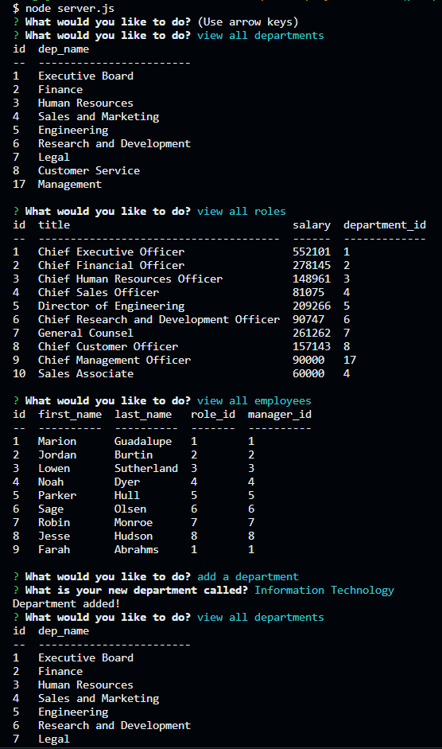
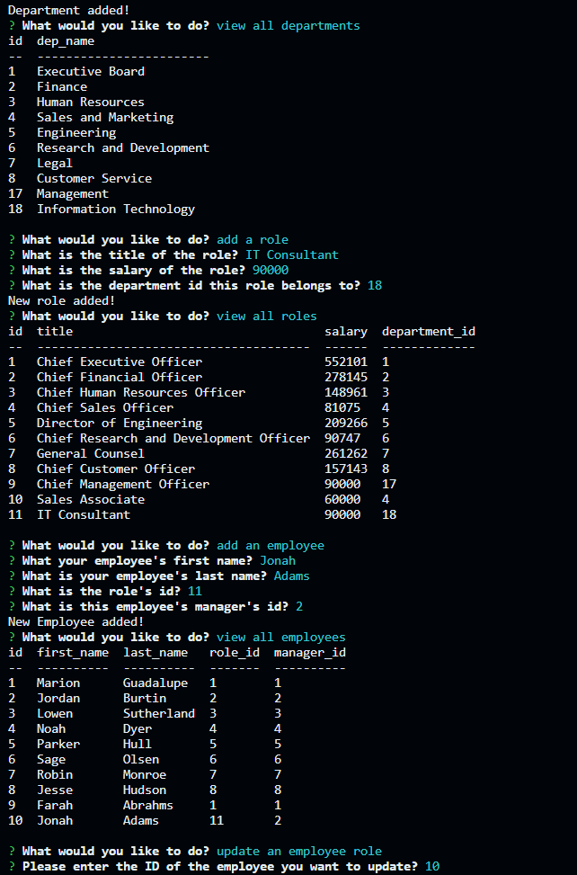
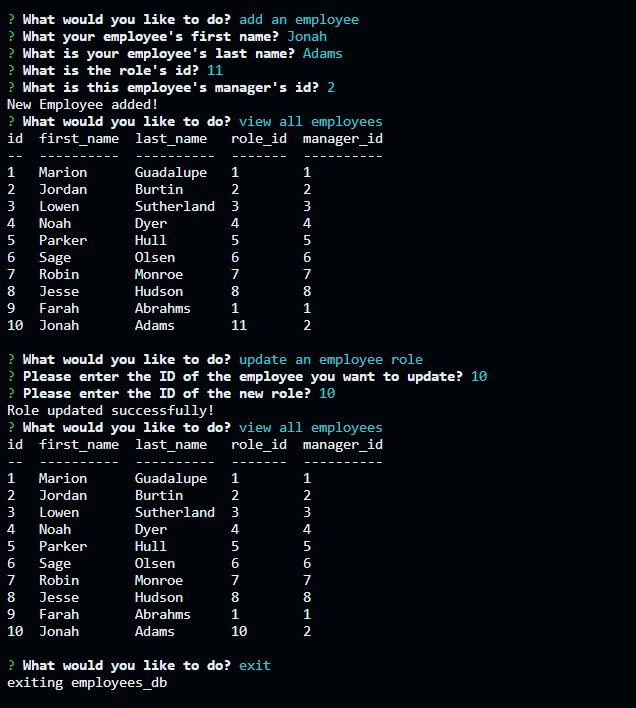

  # SQL Employee Tracker

  ## Description

  This is a command-line application to manage the employee database for a company using Inquirer, NodeJS and MySQL.

  ## Table of Contents
   - [Description](#description)
   - [Installation](#installation)
   - [Usage](#usage)
   - [License](#license)
   - [Contributions](#contributions)
   - [License](#license)
   - [Contact Me](#contact-me)

  ## Installation

    1. Clone this github repository to your machine
    2. Install Inquirer with "npm i inquirer@8.2.4"
    3. Install necessary dependencies with "npm install"
    4. Ensure you have MySQL installed

  ## Usage

  Once you have everything you need to install, open index.js in the integrated terminal and run "node index.js". YOu should be given the options to view all departments, view all roles, view all employees, all a department, add a role, add an employee, and update employee role.

  [DEMO](https://drive.google.com/file/d/1kLwa_NBzgsFM_uiOcBspkkNjWw91usiC/view)

  
  
  

  ## Credits

  N/A

  ## Contributions

  N/A

  ## License

   Licensed by the MIT License: https://opensource.org/licenses/MIT

  ## Contact Me
  Have any Questions? Contact me at:

  [My GitHub](https://github.com/abi-gail17)

  or email me at cinco.de.abby@gmail.com

